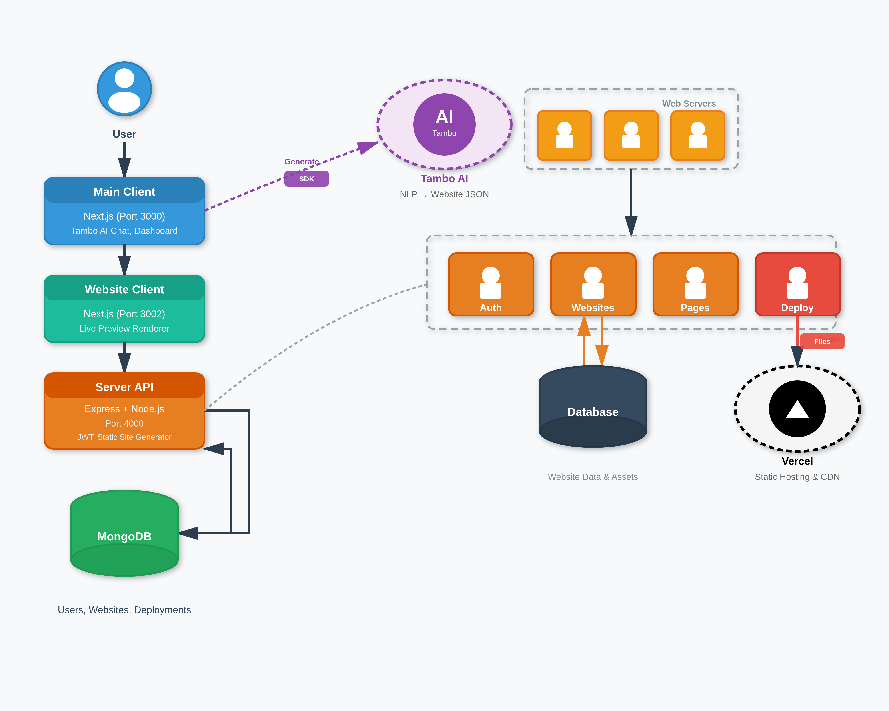
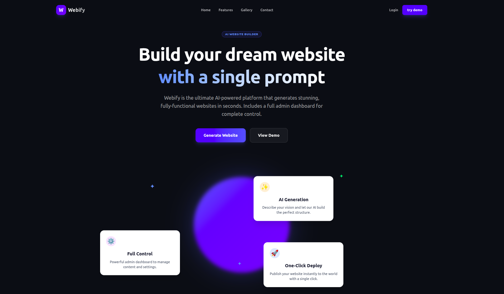
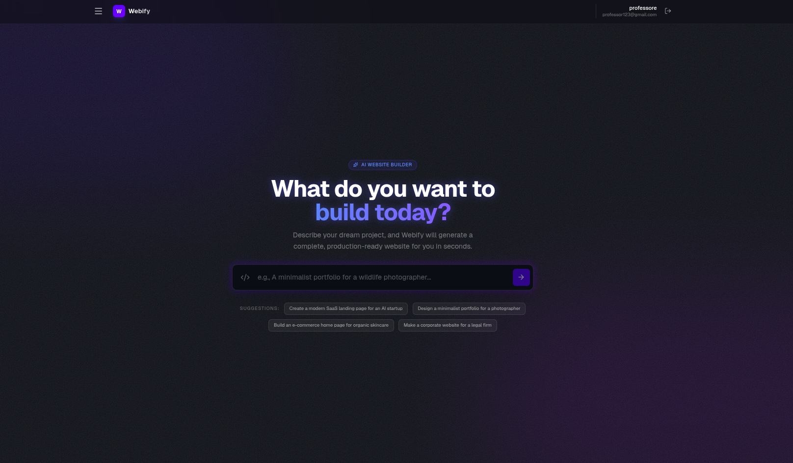
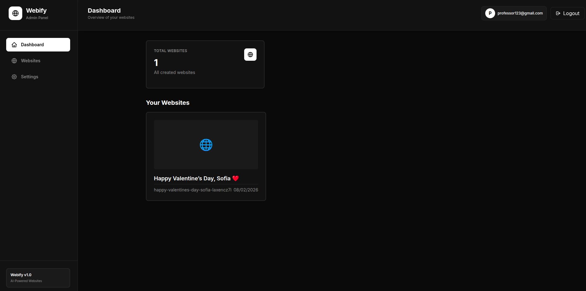

# 🚀 Webify - AI-Powered Website Builder

> **Build beautiful websites through conversation. Powered by Tambo AI.**

Webify is an intelligent website generation platform that transforms natural language descriptions into fully-functional, responsive websites. Simply describe your vision, and watch as AI creates a complete website with themes, sections, and content.

---

## 📋 Table of Contents

- [Features](#-features)
- [Architecture](#️-architecture)
- [Tambo AI Integration](#-tambo-ai-integration)
- [Technology Stack](#️-technology-stack)
- [Project Structure](#-project-structure)
- [Getting Started](#-getting-started)
  - [Prerequisites](#prerequisites)
  - [Installation](#installation)
- [Contributing](#-contributing)
- [Acknowledgments](#-acknowledgments)
- [Support](#-support)

---

## 🎯 Introduction

### What is Webify?

Webify is a next-generation website builder that harnesses the power of **Tambo AI** to transform natural language into professional websites. Unlike traditional website builders that require you to drag, drop, and configure countless settings, Webify lets you simply describe what you want in plain English.

### The Problem

Building websites typically requires:
- ❌ Learning complex drag-and-drop interfaces
- ❌ Understanding design principles and color theory
- ❌ Manually placing and configuring each component
- ❌ Writing content for every section
- ❌ Hours or days of work

### Our Solution

With Webify, you just:
- ✅ Describe your website in natural language
- ✅ Let AI generate the complete structure, content, and design
- ✅ Get a live preview instantly
- ✅ Save and share in minutes

**Example:** Instead of spending hours building a restaurant website, simply say:

> *"Create a modern Italian restaurant website with a hero section showcasing our signature dishes, a menu section with our offerings, customer testimonials, and a contact form for reservations."*

Webify's AI understands your requirements and generates a complete, responsive website with:
- Intelligent component selection (Hero, Menu/Features, Testimonials, Contact)
- Professional content generation
- Beautiful color themes
- Responsive design
- Real images from Unsplash

### Why Webify?

**🚀 Speed** - Generate complete websites in seconds, not hours  
**🎨 Quality** - Professional designs with AI-generated themes  
**🧠 Intelligence** - Context-aware content that matches your industry  
**💪 Flexibility** - 9 customizable components, infinite combinations  
**🔒 Ownership** - Export static HTML/CSS/JS files you fully own  

### Perfect For

- **Small Businesses** - Restaurants, cafes, local shops
- **Freelancers** - Portfolios for designers, photographers, developers
- **Startups** - Landing pages for product launches
- **Educators** - Course websites, tutorial platforms
- **Communities** - Club pages, event sites
- **Anyone** who needs a website but doesn't want to spend weeks building it

---

## ✨ Features

- 🤖 **AI-Powered Generation** - Create websites through natural conversation with Tambo AI
- 🎨 **Smart Theming** - Automatic color palette generation matching your brand
- 📱 **Fully Responsive** - Mobile-first design that works on all devices
- 🔐 **User Authentication** - Secure JWT-based authentication system
- 💾 **Database Persistence** - Save and manage unlimited websites
- 👁️ **Live Preview** - Real-time website rendering with animations

---

## 🏗️ Architecture

Webify uses a multi-client architecture with three specialized applications:

<div style="width: 100%; max-width: 800px;">
  
</div>
---

## 🤖 Tambo AI Integration

### How It Works

Webify leverages **Tambo AI** to understand user requirements and generate structured website data.

**1. Component Schemas** - Define what components exist using Zod:

```typescript
// Define what data a Hero section needs
const heroSchema = z.object({
    heading: z.string().nullish().describe('Main headline'),
    subheading: z.string().nullish().describe('Supporting text'),
    ctaText: z.string().nullish().describe('Button text'),
    ctaLink: z.string().nullish().describe('Button URL'),
});
```

**2. Register Components** - Tell Tambo what's available:

```typescript
export const tamboComponents: TamboComponent[] = [
    {
        name: 'Hero',
        schema: heroSchema,
        description: 'Hero section with headline and CTA'
    },
    // ... 8 more components
];
```

**3. User Interaction** - Natural conversation generates websites:

```
User: "Create a fitness gym website with services and testimonials"
  ↓
Tambo AI: Analyzes → Selects components → Generates content
  ↓
Result: Complete website JSON with Hero, Features, Testimonials, etc.
```

### Available Components

- **Hero** - Landing sections with headlines and CTAs
- **NavBar** - Navigation with logo and links
- **Features** - Feature grids (up to 6 columns)
- **About** - About sections with images
- **Gallery** - Image galleries (up to 6 columns)
- **Testimonials** - Customer testimonial cards
- **Contact** - Contact information sections
- **CTA** - Call-to-action sections
- **Footer** - Page footers with links

---

## 🛠️ Technology Stack

### Frontend
- **Framework**: Next.js 16 (App Router)
- **UI Library**: React 19
- **Styling**: Tailwind CSS 4
- **AI Integration**: Tambo AI SDK (`@tambo-ai/react`)
- **Animations**: Framer Motion
- **Validation**: Zod
- **HTTP Client**: Axios

### Backend
- **Runtime**: Node.js
- **Framework**: Express 5
- **Language**: TypeScript
- **Database**: MongoDB with Mongoose
- **Authentication**: JWT (jsonwebtoken)
- **Security**: Helmet, bcrypt, CORS
- **Validation**: express-validator

---

## Screenshots
<div style="width: 100%; max-width: 1000px;">
  
</div>
<div style="width: 100%; max-width: 1000px;">
  
</div>
<div style="width: 100%; max-width: 1000px;">
  
</div>

---

## 🚀 Getting Started

### Prerequisites

- Node.js 18+ and npm
- MongoDB (local or MongoDB Atlas)
- Tambo AI API key - [Get one here](https://tambo.ai)

### Installation

1. **Clone the repository:**
   ```bash
   git clone <your-repo-url>
   cd Webify
   ```

2. **Install dependencies:**
   ```bash
   # Main Client
   cd main_client
   npm install

   # Server
   cd ../server
   npm install

   # Website Client
   cd ../website_client
   npm install
   ```

3. **Configure environment variables:**

   **Main Client** (`main_client/.env.local`):
   ```env
   NEXT_PUBLIC_TAMBO_API_KEY=your_tambo_api_key
   NEXT_PUBLIC_API_URL=http://localhost:4000/api
   NEXT_PUBLIC_WEBSITE_URL=http://localhost:3002
   ```

   **Server** (`server/.env`):
   ```env
   MONGODB_URI=mongodb://localhost:27017/webify
   JWT_SECRET=your_super_secret_jwt_key_here
   PORT=4000
   CLIENT_URL=http://localhost:3000
   WEBSITE_URL=http://localhost:3002
   ```

   **Website Client** (`website_client/.env.local`):
   ```env
   NEXT_PUBLIC_API_URL=http://localhost:4000/api
   ```

4. **Start all services:**

   **Terminal 1** - Server:
   ```bash
   cd server
   npm run dev
   ```

   **Terminal 2** - Main Client:
   ```bash
   cd main_client
   npm run dev
   ```

   **Terminal 3** - Website Client:
   ```bash
   cd website_client
   npm run dev
   ```

5. **Access the applications:**
   - Main Client: http://localhost:3000
   - Server API: http://localhost:4000
   - Website Preview: http://localhost:3002

---


## 🤝 Contributing

Contributions are welcome! Please follow these steps:

1. Fork the repository
2. Create a feature branch (`git checkout -b feature/amazing-feature`)
3. Commit your changes (`git commit -m 'Add amazing feature'`)
4. Push to the branch (`git push origin feature/amazing-feature`)
5. Open a Pull Request

---

## 🙏 Acknowledgments

- **[Tambo AI](https://tambo.ai)** - For the incredible AI SDK
- **Vercel** - For Next.js framework
- **MongoDB** - For the database solution
- **Unsplash** - For beautiful stock images

---

## 📞 Support

For questions or issues, please open an issue on GitHub.

---

**Built with ❤️ using Tambo AI, Next.js, and MongoDB**
